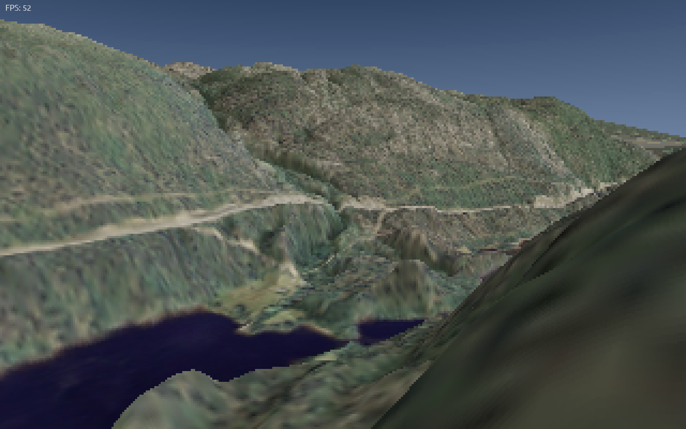

# Vond
A hybrid voxel/polygon 3D renderer that runs on the CPU.

Draws inspiration from the 1990s Delta Force and Outcast games.

This software is currently in very early alpha.

\
(Rendered by Vond with surface data from  the National Land Survey of Finland: orthophoto & elevation model 11/2020.)

# Building
To build Vond, you'll need a C++20-compatible compiler, Qt, and OpenMP.

On Linux, do ```qmake && make```, or load the .pro file in Qt Creator.

Building on Windows should be much the same, though I can't say for sure.
