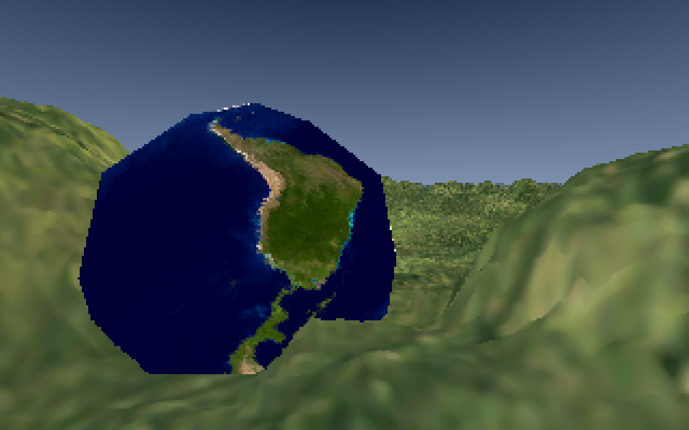
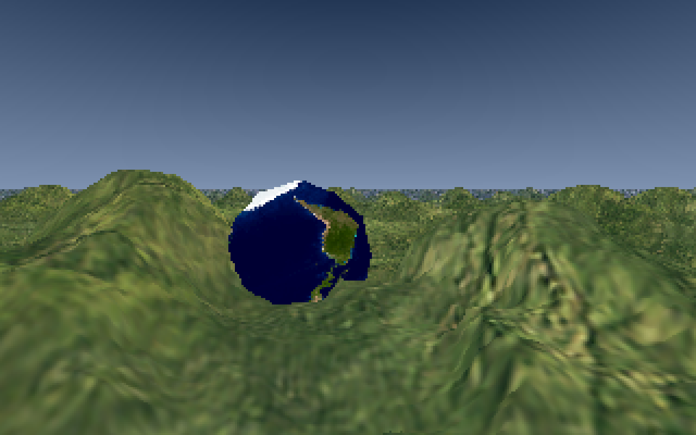
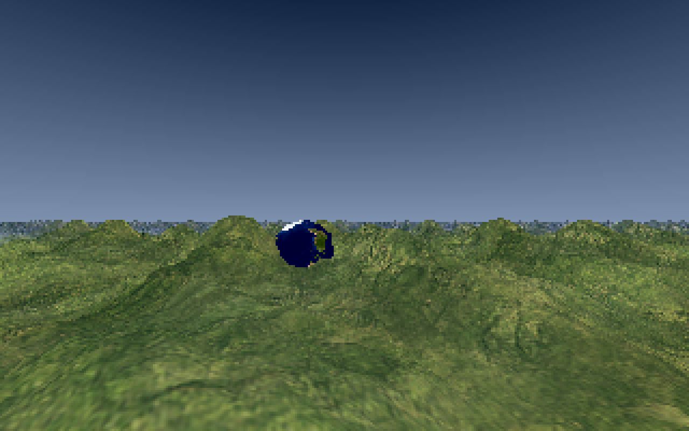

# Vond
A hybrid voxel/polygon 3D renderer. Runs on the CPU.

Draws inspiration from the 1990s Delta Force and Outcast games.

This software is currently in very early alpha.





### Building
To build Vond, you'll need Qt and OpenMP.

On Linux, do ```qmake && make```, or load the .pro file in Qt Creator.

Building on Windows should be much the same, though I can't say for sure.
